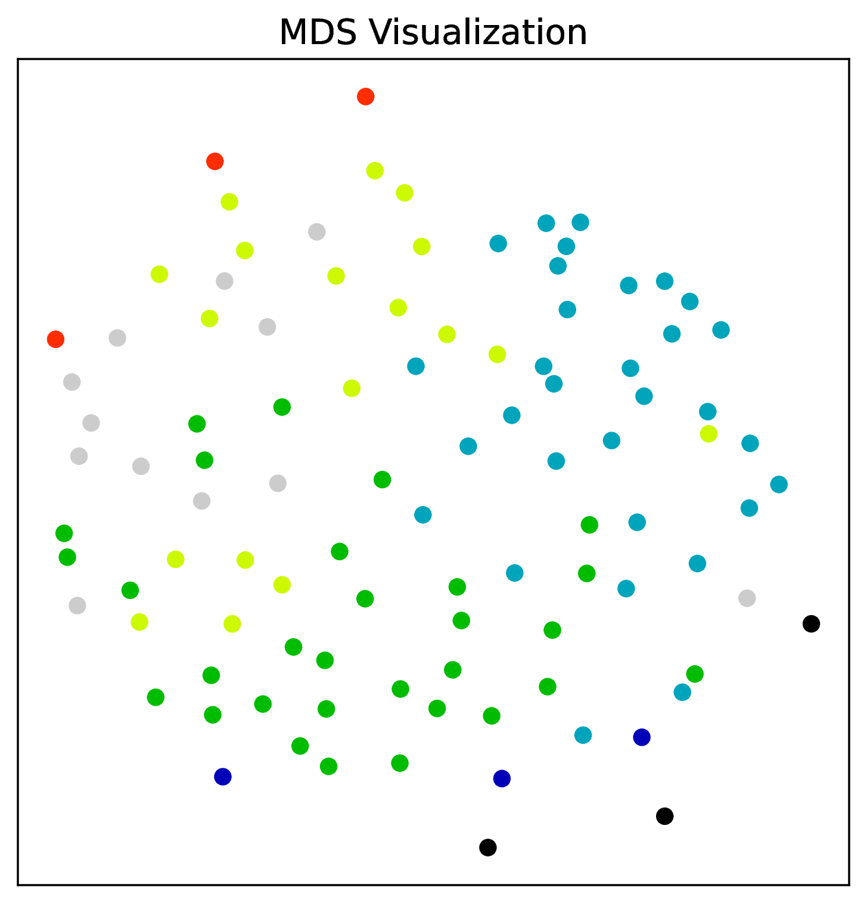
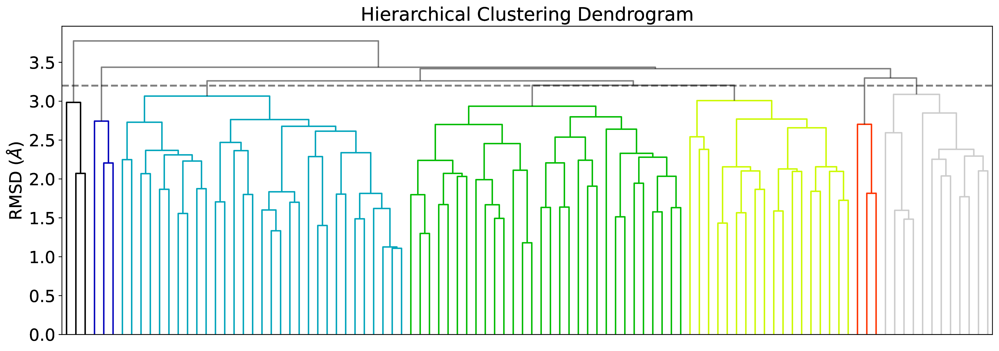
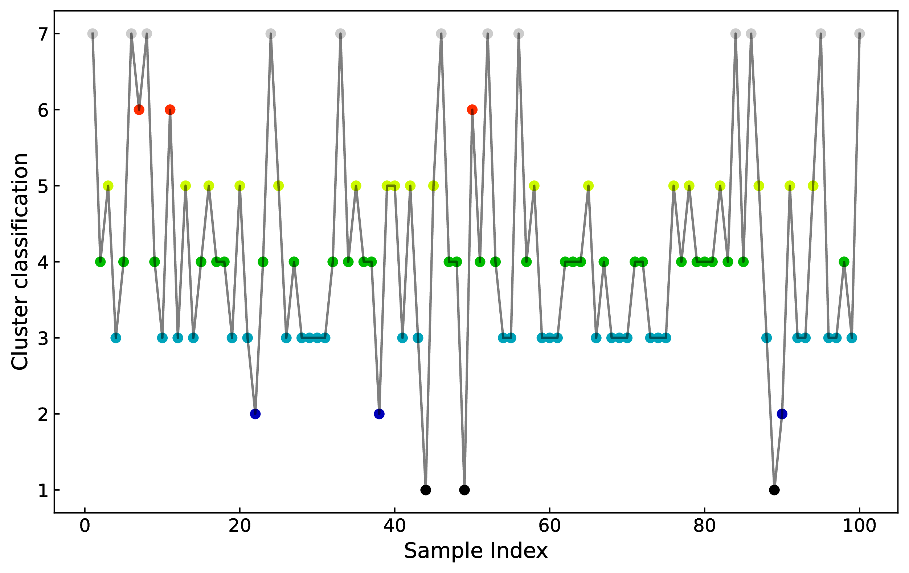

# ClustTraj - A Python package for clustering similar structures from molecular simulations
This Python package receives a molecular dynamics or Monte Carlo trajectory (in .pdb, .xyz or any format supported by OpenBabel), finds the minimum RMSD between the structures with the Kabsch algorithm and performs agglomerative clustering (a kind of unsupervised machine learning) to classify similar conformations. 

What the script does is to calculate the distance (using the minimum RMSD) between each configuration of the trajectory, building a distance matrix (stored in the condensed form).
Different strategies can be used in order to compute distances that correspond to the expected minimum RMSD, such as atom reordering or stepwise alignments.
Notice that calculating the distance matrix might take some time depending on how long your trajectories are and how many atoms there are in each configuration.
The distance matrix can also be read from a file (with the `-i` option) to avoid recalculating it every time you want to change the linkage method (with`-m`) or distance of the clustering.

## Dependencies
The following libraries are required:
- [argparse](https://docs.python.org/3/library/argparse.html)
- [NumPy](http://www.numpy.org/)
- [OpenBabel](http://openbabel.org/)
- [RMSD](https://github.com/charnley/rmsd)
- [QML](https://github.com/qmlcode/qml)
- [SciPy](https://www.scipy.org/)
- [scikit-learn](http://scikit-learn.org/stable/index.html)
- [matplotlib](https://matplotlib.org/)

We use the development branch of `QML` as one of the reordering algorithms.
Since the development of `QML` has been quite slow, we provide our [own branch](https://github.com/hmcezar/qml/tree/develop) in which installation using modern versions of `numpy` is possible.

For `openbabel`, we use the `pip` package `openbabel-wheel` which provides pre-built `openbabel` packages for Linux and MacOS.
More details can be seen in the [projects' GitHub page](https://github.com/njzjz/openbabel-wheel).


To install the package you should go to the cloned repository and use `pip`
```bash
pip install .
``` 

You can use `-e` for "developer mode".

**TODO**: when we upload to PyPI replace installation to `pip install clusttraj`


## Usage
To see all the options run the script with the `-h` command option:
```bash
clusttraj -h
```

or

```bash
python -m clusttraj -h
```

The only mandatory arguments are the path to the file containing the trajectory (in a format that OpenBabel can read with Pybel) and the maximum RMSD between two configurations for them to be considered of the same cluster.
```
clusttraj trajectory.xyz 1.0
```

Additional options are available for specifying the input and output files and selecting how the clustering is done.
The possible methods used for the agglomerative clustering are the ones available in the linkage method of SciPy's hierarchical clustering.
A list with the possible methods (selected with `-m`) and the description of each of them can be found [here](https://docs.scipy.org/doc/scipy/reference/generated/scipy.cluster.hierarchy.linkage.html).

The default method for the linkage is `average`, since [it was found](https://dx.doi.org/10.1021/ct700119m) to have a good compromise with the number of clusters and the actual similarity.
To learn more about how the clustering is performed using this algorithm, see [UPGMA](https://en.wikipedia.org/wiki/UPGMA).

If the `-n` option is used, the hydrogens are ignored when performing the Kabsch algorithm to find the superposition and calculating the RMSD.
This is useful to avoid clustering identical structures with just a methyl group rotated as different.

The `-e` or `--reorder` option, tries to reorder the atoms to increase the overlap and reduce the RMSD. 
The algorithm can be selected with `--reorder-alg`, between qml (default), hungarian, brute or distance. 
For more information about the implementation, see the [RMSD](https://github.com/charnley/rmsd) package.
The reorder option can be used together with the `-ns` option, that receives an integer with the number of atoms of the solute.
When the `-ns` option is used, the script will first superpose the configurations considering only the solute atoms and then reorder considering only the solvent atoms (the atoms in the input that are after the ns atoms).
For solute-solvent systems, the use of `-ns` is strongly encouraged.

To use an already saved distance matrix, specify the file containing the distance matrix in the condensed form with the `-i` option.
The options `-i` and `-od` are mutually exclusive.

The `-p` flag specifies that pdf plots of some information will be saved.
In this case, the filenames will start with the same name used for the clusters output (specified with the `-oc` option).
When the option is used, the following is saved to disk:
- A plot with the [multidimensional scaling](http://scikit-learn.org/stable/modules/manifold.html#multidimensional-scaling) representation of the distance matrix, colored with the clustering information
- The [dendrogram](https://en.wikipedia.org/wiki/Dendrogram)
- The cluster classification evolution, that shows how during the trajectory, the configurations were classificated. This might be useful to analyze the quality of your sampling.

If the `-cc` option is specified (along with a format supported by OpenBabel) the configurations belonging to the same cluster are superposed and printed to a file.
The superpositions are done considering the [medoid](https://en.wikipedia.org/wiki/Medoid) of the cluster as reference.
The medoid is printed as the first structure in the clustered strcuture files.
If you did not consider the hydrogens while building the distance matrix, remember to use the `-n` option even if with `-i` in this case, since the superposition is done considering the flag.

## Threading and parallelization
The `-np` option specified the number of processes to be used to calculate the distance matrix.
Since this is the most time consuming task of the clustering, and due to being a embarassingly parallel problem, it was parallelized using a Python [multiprocessing pool](https://docs.python.org/3/library/multiprocessing.html).
The default value for `-np` is 4.

When using `-np` make sure you also set the correct number of threads for `numpy`.
If you want to use just the `multiprocessing` parallelization (recommended) use the following bash commands to set the number of `numpy` threads to one:
```bash
export OMP_NUM_THREADS=1
export OPENBLAS_NUM_THREADS=1
export MKL_NUM_THREADS=1
export VECLIB_MAXIMUM_THREADS=1
export NUMEXPR_NUM_THREADS=1
```

## Output
The logging is done both to `stdout` and to the file `clusttraj.log`.
The number of clusters that were found, as well as the number of members for each cluster are printed in a table.
Below there is an example of how this information is printed:
```
$ clusttraj trajectory.xyz 3.2 -np 4 -p -n -cc xyz

2023-08-25 11:37:35,201 INFO     [distmat.py:22] <get_distmat> Calculating distance matrix using 4 threads

2023-08-25 11:37:35,770 INFO     [distmat.py:26] <get_distmat> Saving condensed distance matrix to distmat.npy

2023-08-25 11:37:35,771 INFO     [classify.py:8] <classify_structures> Starting clustering using 'average' method to join the clusters

2023-08-25 11:37:35,772 INFO     [classify.py:15] <classify_structures> Saving clustering classification to clusters.dat

2023-08-25 11:37:35,772 INFO     [main.py:41] <main> Writing superposed configurations per cluster to files clusters_confs_*.xyz

2023-08-25 11:37:37,797 INFO     [main.py:71] <main> A total 100 snapshots were read and 16 cluster(s) was(were) found.
The cluster sizes are:
Cluster Size
1       3
2       6
3       6
4       8
5       7
6       6
7       11
8       2
9       6
10      11
11      6
12      5
13      4
14      7
15      4
16      8
```

In the cluster output file (`-oc` option, default filename `clusters.dat`) the classification for each structure in the trajectory is printed.
For example, if the first structure of the trajectory belongs to the cluster number *2*, the second structure belongs to cluster *1*, the third to cluster *2* and so on, the file `clusters.dat` will start with
```
2
1
2
...
```

The plot of the multidimensional representation (when the `-p` option is used) have each cluster colored in one color as the following picture:


The dendrogram has an horizontal line plotted with it indicating the cutoff used for defining the clusters:


The evolution of the classification with the trajectory looks like:


If you wish to use the distance matrix file to other uses, bear in mind that the matrix is stored in the condensed form, i.e., only the superior diagonal matrix is printed (not including the diagonal) in NumPy's `.npy` format.
It means that if you have `N` structures in your trajectory, your file (specified with `-od` option, default filename `distmat.npy`) will have `N(N-1)/2` lines, with each line representing a distance.

